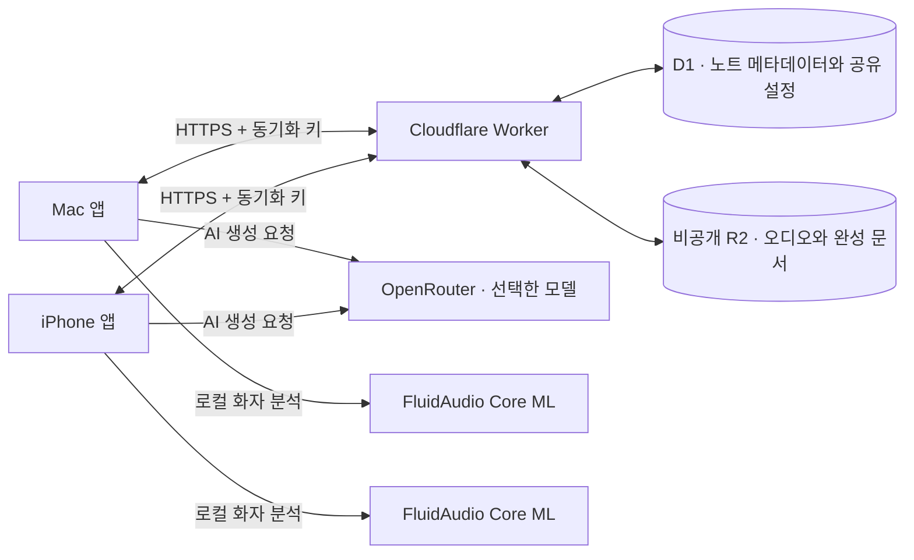

# AI-NoteTaker

**Mac에서 회의를 녹음하고, AI 회의록과 발화자별 전사문을 iPhone에서도 이어서 확인하세요.**

AI-NoteTaker는 SwiftUI로 만든 macOS·iOS 개인용 음성 노트 앱입니다. OpenRouter 기반 AI 미팅 기록, FluidAudio 기반 로컬 화자 분석, Mac ↔ iPhone 자동 동기화, 사용자 소유 Cloudflare Worker/D1/R2 저장소를 지원합니다. 기본 녹음과 재생은 로컬에서 동작하고, AI 생성·동기화·화자 분석은 설정에서 선택해 사용합니다.

> **macOS 26+ · iOS 17+ · Apple Silicon Mac · Swift 6**
> App Store 배포 없이 Xcode로 개인 Mac과 iPhone/iPad에 설치하는 구성을 기준으로 합니다.

현재 버전은 **1.6.0 (빌드 17)**입니다. 맥락 기반 전사 정리와 원문 비교를 지원하고, 보완 예시를 개인정보 없는 내용으로 교체했습니다. [변경 및 검증 기록](docs/implementation/CONTEXTUAL-TRANSCRIPT-CLEANUP.md)

- [작업 예정 기능 목록](docs/FEATURE-BACKLOG.md)
- [Cloudflare 배포 및 API 가이드](Cloudflare/README.md)
- [서드파티 라이선스 고지](THIRD-PARTY-NOTICES.md)

## 주요 기능

### 회의 녹음과 라이브러리

| 기능 | Mac | iPhone / iPad |
| --- | --- | --- |
| 마이크 녹음·일시정지·재개 | ✓ | ✓ |
| 시스템 오디오 녹음 | ✓ | — |
| 마이크 + 시스템 오디오 동시 녹음 | ✓ | — |
| 저장된 녹음 재생·탐색 | ✓ | ✓ |
| 제목 검색·이름 변경·즐겨찾기 | ✓ | ✓ |
| 녹음 폴더·폴더별 보기·기기 간 폴더 동기화 | ✓ | ✓ |
| 최근 삭제한 항목·복원 | ✓ | ✓ |
| AI 회의록·전사문·회의 분석 | ✓ | ✓ |
| Cloudflare 동기화 | ✓ | ✓ |
| 메뉴 막대 녹음·키보드 단축키 | ✓ | — |

Mac에서는 메인 창을 닫아도 메뉴 막대에서 녹음을 제어할 수 있습니다. 두 플랫폼은 같은 앱 이름과 앱 아이콘을 사용합니다.

### 녹음 폴더

왼쪽 목록의 **폴더 +**에서 폴더를 만들고, 녹음의 메뉴에서 **폴더로 이동**을 선택합니다. iPhone에서도 녹음 목록의 폴더 영역과 길게 누르기 메뉴를 사용합니다. 폴더별 녹음 수, 이름 변경, 폴더 삭제를 지원하며, 빈 폴더도 두 기기에 동기화됩니다.

폴더를 만들어도 현재 보고 있는 녹음 목록은 그대로 유지합니다. Mac에서는 상단 **모든 녹음 항목**으로 언제든 전체 목록에 돌아갑니다. 폴더 왼쪽 화살표를 눌러 내부 녹음을 펼치고 접을 수 있습니다. 녹음을 폴더로 끌어놓아 이동하고, 폴더 자체는 다른 폴더 위·아래의 삽입선에 놓아 순서를 바꿉니다. 폴더 밖으로 꺼낼 때는 목록의 **여기로 끌어놓아 폴더 밖으로 이동** 영역을 사용합니다. 변경한 폴더 순서는 iPhone에도 동기화되며, iPhone의 필터 메뉴에서도 전체 목록과 폴더를 명확하게 선택할 수 있습니다.

폴더를 선택하고 새 녹음을 시작하면 해당 폴더에 저장합니다. 녹음 중 다른 목록을 열어도 시작할 때 선택한 폴더를 유지합니다. 폴더를 삭제해도 녹음은 삭제하지 않으며 **모든 녹음**에서 계속 볼 수 있습니다. 폴더는 한 단계만 지원합니다.

### OpenRouter AI 미팅 기록

- 녹음 오디오를 전사하고 회의 내용을 Markdown 회의록으로 정리합니다.
- **회의록 / 전사문 / AI 회의 분석** 화면을 전환해 긴 회의를 탐색합니다.
- 회의록을 복사하거나 다시 생성할 수 있으며, 생성 진행 상태와 취소 기능을 제공합니다.
- 생성일, 녹음 길이, 사용 모델과 제공자가 반환한 비용 정보를 표시합니다.
- 회의록 모델과 음성 인식 모델을 각각 검색·선택할 수 있습니다.
- 출력 언어는 **한국어 / 영어 / 원문 언어**를 지원합니다.
- 새 녹음이 끝난 뒤 AI 회의록을 자동 생성하도록 설정할 수 있습니다.
- 같은 오디오 버전과 전사 모델로 다시 생성할 때는 완료된 전사문을 재사용합니다.

AI 생성을 실행하면 녹음 오디오와 전사문이 OpenRouter 및 선택한 모델 제공자에게 전송됩니다. 이용 요금은 선택한 모델과 사용량에 따라 OpenRouter 계정에 부과됩니다. 화면의 비용은 제공자가 반환한 값이며, 값이 없는 경우 표시되지 않을 수 있습니다.

Mac과 iPhone에서 동일한 AI 기능과 공유 설정을 사용할 수 있습니다. 이미 동기화된 회의록을 읽는 데는 OpenRouter API 키가 필요하지 않습니다. 새 AI 생성을 실행할 기기에만 키를 등록하면 됩니다. 다른 기기에 키가 등록되어 있으면 키가 없는 기기의 AI 설정에 안내와 입력 버튼이 표시됩니다. 키를 저장하거나 삭제해도 공유된 모델·언어·자동 생성 설정은 유지되며, 키가 없는 기기에서는 AI 생성이 실행되지 않습니다.

### 회의 분석과 발화자별 전사

AI-NoteTaker는 기존 Markdown 회의록에 더해 회의 구조를 별도 문서로 저장합니다. 이 문서는 원본 전사와 녹음 시간을 보존한 상태에서 화면 표시와 검색·재생에 사용됩니다.

- **발화자별 전사문**: 전사문을 시간 구간별 발화로 나누고, 화자 라벨과 발화 시간을 표시합니다.
- **원본 근거 재생**: 발화, 결정, 질문, 약속, 요청에서 해당 녹음 구간을 바로 재생합니다.
- **내 발화 보기**: 등록된 목소리와 사용자 수정 정보를 바탕으로 소유자 발화를 추정하고, 내 발화만 모아 보거나 연속 재생합니다.
- **약속과 요청**: 내가 한 약속과 나에게 요청된 일을 분리하고, 완료·제외 상태를 관리합니다.
- **질문과 답변**: 질문, 답변, 답변 없음 또는 불확실한 항목을 근거 발화와 함께 보여줍니다.
- **결정 흐름**: 제안, 우려, 보류, 수정, 최종 결정을 시간 흐름으로 정리합니다.
- **프로젝트 브리핑**: 같은 프로젝트의 이전 회의에서 미완료 약속, 미해결 질문, 주요 결정을 다음 회의 준비 자료로 모읍니다.
- **화자·프로젝트 수정**: 화자 이름, 본인 표시, 개별 발화의 화자, 프로젝트 이름을 직접 수정할 수 있습니다.
- **용어 사전과 표시 보정**: 사람·회사·프로젝트·약어·일반 용어를 등록하면 전사문 옆에 “들린 표현 → 선호 표기” 주석을 표시합니다. 원본 전사 텍스트 자체는 덮어쓰지 않습니다.

화자 분석은 FluidAudio `0.15.6`의 Core ML speaker diarization 경로를 사용합니다. 앱은 `FluidInference/speaker-diarization-coreml`에서 제공되는 `pyannote_segmentation.mlmodelc`와 `wespeaker_v2.mlmodelc` 모델을 준비해 사용합니다. 네트워크 접근이 제한된 환경에서는 모델을 미리 내려받아 앱의 모델 저장 위치에 둘 수 있습니다. 모델은 앱 지원 디렉터리의 `AI-NoteTaker/VoiceModels` 아래에 저장되며, 다운로드가 완료된 뒤에는 화자 분석에 인터넷이 필요하지 않습니다.

### 참여자 번호와 AI 보완

**AI 회의록 → 전사문**에서 `참여자 1: 내용`처럼 누가 말했는지 번호로 확인합니다. 같은 화자는 같은 번호를 유지하고, 불분명한 목소리는 **참여자 미확인**으로 표시합니다. 기존 일반 전사문에는 **참여자 구분**을 눌러 번호를 추가할 수 있습니다. 타임스탬프 전사와 FluidAudio 분석을 이용하며, 분석이 불가능하면 원래 전사문을 유지합니다.

전사 모델이 길이 0인 단어 시간을 반환해도 전체 참여자 구분을 실패시키지 않습니다. 텍스트는 보존하고 불분명한 부분의 화자는 미확인으로 남깁니다. 녹음 끝의 시간 패딩은 실제 녹음 범위로 제한합니다. 저장된 상세 전사가 있으면 재사용하며, 준비·전사 구간 수·로컬 화자 구분 단계를 표시합니다.

GPT Transcribe처럼 시간 정보를 지원하지 않는 모델을 선택한 경우 **원래 전사에는 선택한 모델을 유지**하고, **참여자 구분**을 눌렀을 때만 Whisper로 시간 정보를 준비합니다. 전사문 화면에 실제 참여자 전사 모델을 표시합니다. 참여자 요청의 첫 구간에서 400 오류 또는 시간 정보 누락이 발생하면 Whisper로 한 번 재시도하며, 인증·크레딧·속도 제한 오류는 재시도하지 않습니다. 참여자 구분이 실패해도 기존 회의록과 원래 전사문은 유지하고 별도 안내를 표시합니다.

회의록의 **AI 보완**에 일정 오류나 빠진 맥락을 입력합니다. 예를 들어 “7월 출시는 확정 일정이 아니라 목표입니다. 예산 검토를 마친 뒤 최종 일정을 정하기로 했다는 맥락을 반영해 주세요”라고 요청할 수 있습니다. **보완안 생성 → 미리보기 → 적용** 순서로 반영하고, 버리기·취소·실패 시 기존 회의록은 유지합니다. 보완 과정에서 원래 전사문은 바꾸지 않습니다.

**AI 설정 → 회의록 보완 모델**에서 전용 모델을 선택할 수 있습니다. 기본값 **회의록 모델과 동일**은 현재 회의록 모델을 따릅니다. 보완 모델 설정과 적용한 결과는 연결된 기기에 동기화됩니다. [사용법과 검증 기록](docs/implementation/TRANSCRIPT-ENHANCEMENT.md)

### 맥락 기반 전사 정리

새 회의록을 만들기 전에 AI가 앞뒤 대화를 참고해 잡음성 문구·비음성 표기·반복 오인식을 정리합니다. 원본 녹음과 전사는 보관하며, **AI 정리본 / 원문**으로 비교할 수 있습니다. 참여자 전사에서는 기존 번호와 시간을 유지합니다.

**설정 → AI 회의록 → 맥락 기반 전사 정리**에서 켜고 끌 수 있으며 기본값은 켜짐입니다. 현재 회의록 모델을 사용하므로 추가 모델 사용료가 발생할 수 있습니다. 정리 과정의 오류·과도한 삭제·수치 변경을 감지하면 원문으로 돌아갑니다.

기존 회의록에서는 **전사 정리**로 정리본만 추가할 수 있습니다. 오디오 재전사와 기존 Markdown 변경은 하지 않습니다. 회의록까지 갱신하려면 **다시 생성**을 사용하세요. 정리본과 자동 정리 설정은 기기 간 동기화됩니다.

### 프로필과 내 목소리 등록

설정의 **프로필** 영역에서 표시 이름, 별칭, 역할, 용어 사전을 관리합니다. 이 텍스트 프로필은 회의 분석 프롬프트와 화면 표시 보정에 사용되며, Cloudflare 동기화를 켠 경우 다른 기기로 공유됩니다.

**내 목소리 녹음 / 다시 녹음**을 누르면 안내 모달이 열립니다. 예문과 녹음 요령을 확인한 뒤 **녹음 시작**을 누르고 평소 회의 때의 목소리로 읽어주세요. 녹음 시간과 진행률이 표시되며, 최소 10초부터 저장할 수 있고 30초에 자동 종료합니다. 취소하거나 닫으면 등록을 중단하고 기존 목소리 프로필을 유지합니다. 실패하면 같은 화면에서 다시 녹음할 수 있습니다.

녹음 화면에서 **마이크 입력 막대와 입력 감지 시간**을 확인할 수 있습니다. 작은 목소리는 제한된 음량 보정 후 실제 말소리 구간으로 검사하며, 무음·잡음을 등록하지 않도록 말소리를 검사합니다. [목소리 등록 검증 기록](docs/implementation/VOICE-ENROLLMENT-QUALITY.md)

내 목소리 등록은 각 기기 안에서만 저장됩니다. 등록 샘플의 원본 오디오를 내보내지 않고, 화자 비교에 필요한 로컬 프로필만 기기 저장소에 둡니다. 삭제하면 해당 기기에서 제거됩니다. 목소리 등록은 “이 발화가 앱 소유자일 가능성이 높다”는 표시를 돕습니다. 불확실한 구간은 불확실한 상태로 표시하고, 사용자가 직접 수정할 수 있습니다.

## Mac ↔ iPhone 자동 동기화

두 기기에 같은 Cloudflare Worker 주소와 동기화 키를 입력하면 다음 항목을 자동으로 맞춥니다.

| 항목 | 동기화 |
| --- | --- |
| 녹음 오디오 | 지원 |
| 제목·날짜·즐겨찾기·삭제 상태 | 지원 |
| 녹음 폴더·이름·순서·삭제 상태·녹음의 폴더 연결 | 지원 |
| 완성된 AI 회의록, 보완 결과와 전체 전사문·참여자 정보·AI 정리본 | 지원 |
| 회의 분석 문서, 발화자별 전사, 약속·요청·질문·결정 | 지원 |
| 화자 이름·본인 표시·프로젝트·업무 상태 수정 이력 | 지원 |
| 텍스트 프로필, 별칭, 역할, 용어 사전, 자동 회의 분석 설정 | 지원 |
| AI 모델·보완 모델·전사 모델·출력 언어·자동 생성·전사 정리 설정 | 지원 |
| OpenRouter API 키 | 기기별 Keychain 보관 |
| 동기화 키 | 기기별 Keychain 보관 |
| 내 목소리 프로필·화자 임베딩 | 기기별 보관 |
| 생성 도중의 부분 전사 캐시 | 기기별 보관 |

앱을 열거나 활성화할 때와 로컬 변경을 완료했을 때 자동으로 동기화합니다. 앱이 실행 중인 동안에는 약 **30초 간격**으로 상대 기기의 변경 사항을 확인합니다. 네트워크 오류는 자동으로 재시도하며, 반복 실패 시 간격을 최대 5분까지 늘립니다. Mac은 창을 닫아도 앱이 실행 중이면 동기화를 계속합니다. iPhone은 백그라운드 갱신을 예약하고 앱을 다시 열면 즉시 갱신합니다. 인터넷 연결이 없어도 저장된 녹음과 회의록을 볼 수 있습니다.

동기화는 Mac과 iPhone에서 생성한 녹음과 회의 자료를 같은 라이브러리에 모으는 기능입니다. 두 장치가 동시에 녹음한 오디오를 하나의 “라이브 회의”로 합치거나 타임라인을 자동 병합하지 않습니다.

## 빠르게 시작하기

### 1. 프로젝트 준비

필요한 도구는 **Xcode 26 이상**, **XcodeGen 2.46 이상**, 그리고 코드 서명에 사용할 Apple Account입니다. Cloudflare를 직접 배포할 때만 Node.js와 Wrangler가 추가로 필요합니다.

```sh
git clone https://github.com/Seonwoo82/AI-NoteTaker.git
cd AI-NoteTaker
test -f Config/Local.xcconfig || cp Config/Local.xcconfig.example Config/Local.xcconfig
```

`Config/Local.xcconfig`의 `DEVELOPMENT_TEAM`을 본인의 Apple 개발 팀 ID로 바꾸고 프로젝트를 생성합니다. 이 로컬 서명 파일은 Git에서 제외됩니다.

```sh
make gen
```

### 2. Mac에 설치

`NoteTaker.xcodeproj`를 열어 **NoteTaker** 스킴을 실행하거나 다음 명령을 사용합니다.

```sh
make build
make run

# 서명된 Release 빌드
make build-release
```

빌드된 앱은 `build/DerivedData/Build/Products/Debug/AI-NoteTaker.app`에 있습니다. 마이크 또는 시스템 오디오 권한은 해당 녹음 모드를 처음 사용할 때 허용합니다. 기존 개발 설치본을 교체할 때는 앱을 삭제하지 않고 같은 번들 ID로 다시 실행하면 로컬 라이브러리와 Keychain 설정을 유지합니다.

### 3. iPhone에 개인 설치

1. iPhone을 Mac에 연결하고 기기 신뢰 및 개발자 모드를 활성화합니다.
2. `iOS/NoteTakerIOS.xcodeproj`를 열고 **NoteTakerIOS** 스킴을 선택합니다.
3. 본인의 서명 팀과 연결된 iPhone을 선택한 뒤 **Run**으로 설치합니다.

App Store나 TestFlight에 출시할 필요가 없습니다. 개발용 프로비저닝 프로파일이 만료되면 Xcode에서 다시 서명·설치합니다. 기존 사용자 데이터는 앱을 삭제하지 않고 업데이트해 유지할 수 있습니다. 다른 개발 팀에서 기본 번들 ID를 사용할 수 없다면 해당 타깃의 `PRODUCT_BUNDLE_IDENTIFIER`를 본인 소유의 고유 값으로 바꿉니다.

시뮬레이터와 기기용 Release 빌드는 다음 명령으로 확인합니다.

```sh
make build-ios
make build-ios-release
```

## AI 회의록 설정

1. 앱의 **설정 → AI 회의록**을 엽니다.
2. OpenRouter API 키를 저장합니다. 키는 해당 기기의 Keychain에 보관합니다.
3. 연결을 확인하고 **회의록 모델**과 **음성 인식 모델**을 선택합니다.
4. 출력 언어와 **녹음 후 회의록 자동 생성** 여부를 정합니다.
5. 추가 회의 분석을 사용하려면 프로필 기반 분석 옵션을 켭니다.
6. 녹음 상세의 **AI 회의록**과 **회의 분석**에서 생성하거나 저장된 문서를 확인합니다.

긴 회의의 최종 회의록과 회의 분석은 **최대 131,072 출력 토큰**, 중간 요약은 **최대 32,768토큰**을 요청합니다. 모델이 알려준 출력 한도와 전체 문맥 크기에 맞춰 자동으로 줄입니다. 이 예산에는 추론 토큰도 포함되며, 반드시 이 길이까지 생성하는 것은 아닙니다. 긴 답변의 대기 시간도 늘렸습니다. [설계와 검증 기록](docs/implementation/LONG-MEETING-OUTPUT.md)

API 키 교체·삭제나 앱 종료 시 진행 중인 AI 작업을 취소합니다. 이미 처리된 요청의 비용은 취소로 되돌릴 수 없습니다. AI 결과는 전사문과 원본 발화 근거를 함께 검토하세요.

## Cloudflare 연동

Cloudflare 구성은 사용자의 계정에 직접 배포합니다. AI-NoteTaker가 운영하는 공용 동기화 서버는 없습니다.



1. `Cloudflare/`에서 Worker, D1 데이터베이스, 비공개 R2 버킷을 준비합니다.
2. `wrangler.toml`에 본인의 D1 ID를 넣고 **모든 마이그레이션을 적용**합니다.
3. 긴 임의 문자열을 Worker의 `SYNC_TOKEN` secret으로 저장한 뒤 배포합니다.
4. Mac과 iPhone의 **설정 → 동기화**에 같은 Worker HTTPS 주소와 동기화 키를 입력합니다.
5. 동기화를 켜고 연결 확인 및 수동 동기화를 실행합니다.

**동기화 키는 Cloudflare 계정 API 토큰이나 OpenRouter API 키와 별개입니다.** Cloudflare 계정 자격 증명을 앱에 입력하지 마세요. 자세한 명령, 인증, 데이터 형식은 [Cloudflare 배포 및 API 가이드](Cloudflare/README.md)에 있습니다.

메타데이터 충돌은 수정 시각과 변경 ID, 완료 회의록 충돌은 생성 시각과 문서 해시를 비교합니다. AI 설정과 텍스트 프로필은 별도의 수정 시각·변경 ID로 합치며, 새 기기의 기본값이 이미 공유된 설정을 덮어쓰지 않습니다. 회의 분석 문서와 수동 수정 이력은 검증 가능한 녹음 ID·오디오 버전·발화 ID만 게시합니다. 기기 시각은 자동으로 설정하는 것이 좋습니다. 삭제 상태는 동기화하며, 클라우드의 녹음 파일과 삭제 기록은 자동 영구 삭제하지 않습니다.

## 데이터 저장과 개인정보

기본 녹음과 재생에는 서버 계정이 필요하지 않습니다. AI 생성과 Cloudflare 동기화를 활성화한 경우에만 해당 기능의 데이터를 전송합니다. 저장된 OpenRouter 키와 동기화 키는 기기의 Keychain에 보관합니다. iOS 동기화 키는 최초 잠금 해제 후 백그라운드에서도 읽을 수 있으며 해당 기기에만 저장합니다.

Mac의 기존 저장 위치는 이름 변경 후에도 유지합니다.

```text
~/Library/Application Support/NoteTaker/Recordings/<recording-id>/
  audio.m4a                 # 녹음
  meta.json                 # 메타데이터
  meeting-notes.json        # 완성된 회의록과 전체 전사문
  meeting-intelligence.json # 발화자별 전사와 분석 문서
  ai-transcript.json        # 생성 도중 전사 구간 캐시
```

폴더 메타데이터는 라이브러리 루트의 `recording-folders.json`에 저장합니다. 로컬 화자 모델과 내 목소리 프로필은 앱 지원 디렉터리의 별도 영역에 저장됩니다. API 키, 동기화 키, 목소리 등록 데이터, 화자 임베딩은 Cloudflare 프로필 DTO에 포함하지 않습니다. iOS에서는 같은 논리를 앱 전용 데이터 컨테이너에 적용합니다. 기존 NoteTaker 설치본을 업데이트할 때 앱 번들 ID와 키체인 식별자를 유지하므로 저장한 녹음과 설정을 계속 사용할 수 있습니다. Markdown 외부 이미지·HTML을 실행하거나 링크를 자동으로 열지 않습니다.

이 저장소에는 실제 녹음·회의록·API 키·개인 서명 설정을 포함하지 않습니다.

## 현재 제한

- iPhone에서는 마이크 녹음을 지원합니다. 다른 앱의 통화·시스템 오디오를 캡처하는 기능은 제공하지 않습니다.
- iOS에서 AI 생성이 오래 걸릴 때는 앱을 열어 두세요. 동기화는 백그라운드 갱신도 요청하지만, 실제 실행 시점은 iOS가 결정합니다. 앱을 강제 종료했거나 백그라운드 앱 새로 고침이 꺼져 있으면 앱을 다시 열어야 갱신될 수 있습니다. 잠긴 상태의 동기화는 재부팅 후 한 번 이상 잠금 해제한 기기에서 가능합니다.
- 동기화 한도는 오디오 파일당 **95 MiB**, 메타데이터 **64 KiB**, 완성된 회의록 JSON **2 MiB**, 회의 분석 JSON **4 MiB**입니다. 초과한 파일은 로컬에 남고 오류를 표시합니다.
- 새 AI 전사는 녹음당 최대 **6시간**, 전사 텍스트 약 **1 MB**, 모델 호출 **240회**로 제한합니다. 이는 요금 한도가 아닙니다.
- 화자 구분과 내 목소리 표시는 녹음 품질, 겹침 발화, 배경 소음, 모델 준비 상태에 따라 틀릴 수 있습니다. 중요한 결론은 원본 발화와 사용자 수정으로 확인하세요.
- 온디바이스 AI 전사, 전사문 검색, 트리밍, 재생 속도 조절, 무음 건너뛰기, 음성 향상은 현재 제공하지 않습니다.
- 개발용 설치의 서명 만료, iOS 잠금·백그라운드 제약, 마이크·시스템 오디오 권한 및 오디오 장치 변경은 실제 기기 환경의 영향을 받습니다.
- Mac은 1.6.0 빌드 17 설치·실행을 확인했고, iPhone은 기존 설치를 유지하며 재연결 후 1.6.0을 설치합니다. 실제 iPhone 목소리 등록은 사용자 확인을 기다립니다. 개인 목소리 등록 데이터는 전송하거나 대신 녹음하지 않았습니다. 자세한 내용은 [목소리 등록 검증 기록](docs/implementation/VOICE-ENROLLMENT-GUIDE.md)에 있습니다.

## 검증 및 배포 현황

현재 문서가 반영하는 버전은 **Mac/iOS 1.6.0, 빌드 17**입니다.

| 항목 | 상태 | 결과 |
| --- | --- | --- |
| Mac 전체 테스트 | 통과 | 463개 통과 |
| iOS 시뮬레이터 전체 테스트 | 통과 | 332개 통과 |
| Cloudflare Worker 테스트 | 통과 | 60개 통과 |
| 폴더 화면 | 통과 | 한국어 정적 렌더: 폴더 내부·생성 후 전체 목록·25개 폴더가 있는 작은 창 |
| FluidAudio `0.15.6` 링크 빌드 | 통과 | Mac과 iOS 시뮬레이터에서 실제 의존성 경로 확인 |
| 공개 30.9초 2화자 fixture | 통과 | 2개 화자 ID 검출 |
| held-out voice 비교 | 통과 | owner cosine 약 0.843, other 약 0.211 |
| 라이브 owner/other 표시 | 통과 | Mac과 iOS 양쪽 확인 |
| 손상된 모델 캐시 복구와 cached-only restore | 통과 | Mac 검증 통과 |
| 1.6.0 빌드 17 Mac Release | 완료 | 백업·서명·설치·실행, 실제 전사 정리 버튼과 일반 예시 확인 |
| 1.6.0 빌드 17 iOS Release | 빌드 완료 | Release 빌드·코드서명·로컬 IPA 검증, 기기 연결 불가로 설치 대기 |
| Cloudflare Worker 배포 | 완료 | 전사 정리본·설정 및 구버전 호환 처리 배포, 인증된 노트·AI 설정 조회 200 |
| iPhone 모델 파일 | 완료 | 공개 모델 파일 13개가 1.3.2 업데이트 후 보존됨을 확인 |
| 목소리 등록 안정성 | 통과 | 오디오 콜백, 연속 입력 시간 오차, 취소·재등록 회귀 테스트 통과 |
| iPhone 설치 | 연결 대기 | 기존 설치 유지, 1.6.0은 기기 재연결 후 설치 |
| 실제 iPhone 목소리 등록 | 확인 대기 | 사용자 목소리로 녹음·저장 확인 필요 |

화자 분석 수치는 공개 fixture와 제한된 검증 샘플의 동작 확인 결과입니다. 최신 앱의 개인 목소리 등록, 실제 사용자 목소리 인식, 실제 마이크 녹음은 실기기 재확인이 필요합니다. 실제 회의에서는 발화 겹침, 소음, 마이크 위치, 언어와 회의 환경에 따라 달라질 수 있습니다.

## 개발과 검증

두 앱을 하나의 저장소에서 빌드합니다. Mac 앱은 루트 프로젝트, iOS 앱은 `iOS/` 프로젝트를 사용합니다. 내부 Xcode 스킴과 Swift 모듈 이름은 기존 이름을 유지하며, 설치되는 앱 이름은 **AI-NoteTaker**입니다.

```sh
make gen
make test-audio          # AudioPipeline 패키지
make test                # Mac 단위 테스트
make test-ios            # iOS 단위 테스트 및 정적 화면 렌더
node --test Cloudflare/tests/worker.test.mjs
```

기본 iOS 테스트 대상은 `iPhone 17 Pro` 시뮬레이터입니다. 설치된 기종이 다르면 `make test-ios IOS_TEST_DESTINATION='platform=iOS Simulator,name=<기종>'`으로 지정합니다. 빌드 병렬 수는 기본 2이며 `JOBS`로 조정할 수 있습니다.

AI 테스트는 가짜 제공자 응답을 사용하므로 실제 OpenRouter 호출을 하지 않습니다. 동기화 테스트는 문서 충돌·해시·크기·부분 실패를 검증하고, Worker 테스트는 라우팅과 실제 SQLite 쿼리 동작을 검사합니다. 별도의 `make uitest`와 `make uitest-ios`는 화면을 조작하므로 일반 단위 테스트와 구분해 실행합니다.

```text
NoteTaker/               Mac 앱, AI 회의록, 라이브러리, 동기화
NoteTakerTests/          Mac 단위 테스트
NoteTakerUITests/        Mac UI 테스트
iOS/NoteTaker/           iOS 앱, AI 회의록, 라이브러리, 동기화
iOS/NoteTakerIOSTests/   iOS 앱 호스트·정적 화면 테스트
iOS/NoteTakerTests/      iOS에 이식한 AI·오디오·동기화 테스트
Packages/AudioPipeline/  Mac 캡처·믹싱·재생 및 공통 녹음 모드
Cloudflare/              Worker, D1 마이그레이션, API 테스트
Config/                  공개용 서명 설정 예시
project.yml              Mac XcodeGen 정의
iOS/project.yml          iOS XcodeGen 정의
```

Mac과 iOS의 플랫폼별 화면·라이브러리는 각각의 타깃에서 관리합니다. AI 문서 형식과 동기화 프로토콜을 변경할 때는 두 타깃과 Worker의 테스트를 함께 확인하세요.

자동 동기화의 백그라운드 동작은 Apple의 [Background Tasks](https://developer.apple.com/documentation/backgroundtasks/refreshing-and-maintaining-your-app-using-background-tasks)와 [earliestBeginDate](https://developer.apple.com/documentation/backgroundtasks/bgtaskrequest/earliestbegindate) 실행 정책을 따릅니다.
