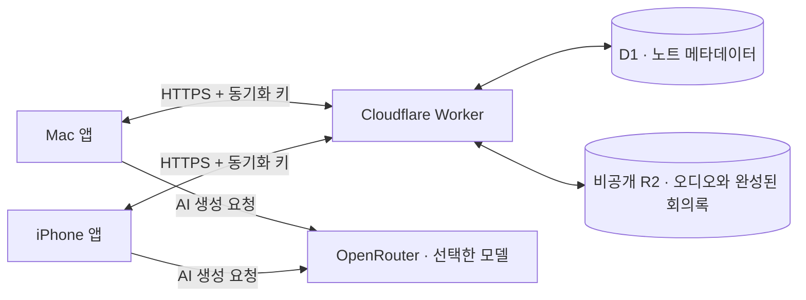

# AI-NoteTaker

**Mac에서 회의를 녹음하고, AI로 정리한 회의록을 iPhone에서도 이어서 확인하세요.**

AI-NoteTaker는 SwiftUI로 만든 macOS·iOS 음성 노트 앱입니다. **OpenRouter를 이용한 음성 인식과 AI 미팅 기록**, **Mac ↔ iPhone 동기화**, **사용자 소유 Cloudflare 저장소**를 지원합니다. 기본 녹음과 재생은 로컬에서 동작하며, AI와 동기화는 설정에서 선택해 사용합니다.

> **macOS 26+ · iOS 17+ · Apple Silicon Mac · Swift 6**
> App Store 배포 없이 Xcode로 개인 iPhone/iPad에 설치할 수 있습니다.

## 주요 기능

### OpenRouter AI 미팅 기록

- 녹음 오디오를 전사하고 회의 내용을 Markdown 회의록으로 정리합니다.
- **회의록 / 전사문**을 전환하고, 제목별 목차로 긴 문서를 탐색합니다.
- 회의록을 복사하거나 다시 생성할 수 있으며, 생성 진행 상태와 취소 기능을 제공합니다.
- 생성일, 녹음 길이, 사용 모델과 제공자가 반환한 비용 정보를 표시합니다.
- 회의록 모델과 음성 인식 모델을 각각 검색·선택할 수 있습니다.
- 출력 언어는 **한국어 / 영어 / 원문 언어**를 지원합니다.
- 새 녹음이 끝난 뒤 AI 회의록을 자동 생성하도록 설정할 수 있습니다.
- 같은 음성 버전과 전사 모델로 다시 생성할 때는 완료된 전사문을 재사용합니다.

**Mac과 iPhone에서 동일한 AI 기능과 설정을 사용할 수 있습니다.** 이미 동기화된 회의록을 읽는 데는 OpenRouter API 키가 필요하지 않습니다. 새로 생성할 기기에만 키를 등록하면 됩니다. 다른 기기에 키가 등록되어 있으면 키가 없는 기기의 AI 설정에 안내와 입력 버튼이 표시됩니다. 키를 저장하거나 삭제해도 공유된 자동 생성 설정은 유지되며, 키가 없는 기기에서는 AI 생성이 실행되지 않습니다.

### Mac ↔ iPhone 동기화

두 기기에 같은 Cloudflare Worker 주소와 동기화 키를 입력하면 다음 항목을 동기화합니다.

| 항목 | 동기화 |
| --- | --- |
| 녹음 오디오 | 지원 |
| 제목·날짜·즐겨찾기·삭제 상태 | 지원 |
| 완성된 AI 회의록과 전체 전사문 | 지원 |
| AI 모델·전사 모델·출력 언어·자동 생성 설정 | 지원 |
| OpenRouter API 키 | 기기별 보관 |
| 생성 도중의 부분 전사 캐시 | 기기별 보관 |

앱을 열거나 활성화할 때와 로컬 변경을 완료했을 때 자동으로 동기화합니다. 앱이 실행 중인 동안에는 약 **30초 간격**으로 상대 기기의 변경 사항을 확인합니다. 네트워크 오류는 자동으로 재시도하며, 반복 실패 시 간격을 최대 5분까지 늘립니다. Mac은 창을 닫아도 앱이 실행 중이면 동기화를 계속합니다. iPhone은 백그라운드 갱신을 예약하고 앱을 다시 열면 즉시 갱신합니다. 수동 동기화도 사용할 수 있습니다. 인터넷 연결이 없어도 저장된 녹음과 회의록을 볼 수 있습니다. 다운로드한 회의록은 크기와 SHA-256을 검증한 뒤 저장하며, 전송에 실패하면 기존 로컬 문서를 유지합니다.

### 녹음과 라이브러리

| 기능 | Mac | iPhone / iPad |
| --- | --- | --- |
| 마이크 녹음·일시정지·재개 | ✓ | ✓ |
| 시스템 오디오 녹음 | ✓ | — |
| 마이크 + 시스템 오디오 동시 녹음 | ✓ | — |
| 저장된 녹음 재생·탐색 | ✓ | ✓ |
| 제목 검색·이름 변경·즐겨찾기 | ✓ | ✓ |
| 최근 삭제한 항목·복원 | ✓ | ✓ |
| AI 회의록·전사문·AI 설정 | ✓ | ✓ |
| Cloudflare 동기화 | ✓ | ✓ |
| 메뉴 막대 녹음·키보드 단축키 | ✓ | — |

Mac에서는 메인 창을 닫아도 메뉴 막대에서 녹음을 제어할 수 있습니다. 두 플랫폼은 같은 앱 아이콘을 사용합니다.

## 빠르게 시작하기

### 1. 프로젝트 준비

필요한 도구는 **Xcode 26 이상**, **XcodeGen 2.46 이상**, 그리고 코드 서명에 사용할 Apple Account입니다. Cloudflare를 직접 배포할 때만 Node.js와 Wrangler가 추가로 필요합니다.

```sh
git clone https://github.com/Seonwoo82/AI-NoteTaker.git
cd AI-NoteTaker
test -f Config/Local.xcconfig || cp Config/Local.xcconfig.example Config/Local.xcconfig
```

`Config/Local.xcconfig`의 `DEVELOPMENT_TEAM`을 본인의 Apple 개발 팀 ID로 바꾸고 프로젝트를 생성합니다. 이 로컬 서명 파일은 Git에서 제외됩니다.

```sh
make gen
```

### 2. Mac에 설치

`NoteTaker.xcodeproj`를 열어 **NoteTaker** 스킴을 실행하거나 다음 명령을 사용합니다.

```sh
make build
make run
```

빌드된 앱은 `build/DerivedData/Build/Products/Debug/AI-NoteTaker.app`에 있습니다. 마이크 또는 시스템 오디오 권한은 해당 녹음 모드를 처음 사용할 때 허용합니다.

### 3. iPhone에 설치

1. iPhone을 Mac에 연결하고 기기 신뢰 및 개발자 모드를 활성화합니다.
2. `iOS/NoteTakerIOS.xcodeproj`를 열고 **NoteTakerIOS** 스킴을 선택합니다.
3. 본인의 서명 팀과 연결된 iPhone을 선택한 뒤 **Run**으로 설치합니다.

App Store나 TestFlight에 출시할 필요가 없습니다. 개발용 프로비저닝 프로파일이 만료되면 Xcode에서 다시 서명·설치합니다. 기존 사용자 데이터는 앱을 삭제하지 않고 업데이트해 유지할 수 있습니다. 다른 개발 팀에서 번들 ID를 사용할 수 없다면 해당 타깃의 `PRODUCT_BUNDLE_IDENTIFIER`를 본인 소유의 고유 값으로 바꿉니다.

시뮬레이터 빌드는 다음 명령으로 확인합니다.

```sh
make build-ios
```

## AI 회의록 설정

1. 앱의 **설정 → AI 회의록**을 엽니다.
2. OpenRouter API 키를 저장합니다. 키는 해당 기기의 Keychain에 보관합니다.
3. 연결을 확인하고 **회의록 모델**과 **음성 인식 모델**을 선택합니다.
4. 출력 언어와 **녹음 후 회의록 자동 생성** 여부를 정합니다.
5. 녹음 상세의 **AI 회의록**에서 생성하거나 저장된 문서를 확인합니다.

AI 생성을 실행하면 녹음 오디오와 전사문이 OpenRouter 및 선택한 모델 제공자에게 전송됩니다. 이용 요금은 선택한 모델과 사용량에 따라 OpenRouter 계정에 부과됩니다. 화면의 비용은 제공자가 반환한 값이며, 값이 없는 경우 표시되지 않을 수 있습니다.

API 키 교체·삭제나 앱 종료 시 진행 중인 AI 작업을 취소합니다. 이미 처리된 요청의 비용은 취소로 되돌릴 수 없습니다. AI 결과는 전사문과 함께 검토하세요.

## Cloudflare 연동

Cloudflare 구성은 사용자의 계정에 직접 배포합니다. AI-NoteTaker가 운영하는 공용 동기화 서버는 없습니다.



1. `Cloudflare/`에서 Worker, D1 데이터베이스, 비공개 R2 버킷을 준비합니다.
2. `wrangler.toml`에 본인의 D1 ID를 넣고 **모든 마이그레이션을 적용**합니다.
3. 긴 임의 문자열을 Worker의 `SYNC_TOKEN` secret으로 저장한 뒤 배포합니다.
4. Mac과 iPhone의 **설정 → 동기화**에 같은 Worker HTTPS 주소와 동기화 키를 입력합니다.
5. 동기화를 켜고 연결 확인 및 수동 동기화를 실행합니다.

**동기화 키는 Cloudflare 계정 API 토큰이나 OpenRouter API 키와 별개입니다.** Cloudflare 계정 자격 증명을 앱에 입력하지 마세요. 자세한 명령, 인증, 데이터 형식은 [Cloudflare 배포 및 API 가이드](Cloudflare/README.md)에 있습니다.

메타데이터 충돌은 수정 시각과 변경 ID, 완료 회의록 충돌은 생성 시각과 문서 해시를 비교합니다. AI 설정은 별도의 수정 시각·변경 ID로 합치며, 새 기기의 기본값이 이미 공유된 설정을 덮어쓰지 않습니다. 기기 시각은 자동으로 설정하는 것이 좋습니다. 삭제 상태는 동기화하며, 클라우드의 녹음 파일과 삭제 기록은 자동 영구 삭제하지 않습니다.

## 데이터 저장과 개인정보

기본 녹음과 재생에는 서버 계정이 필요하지 않습니다. AI 생성과 Cloudflare 동기화를 활성화한 경우에만 해당 기능의 데이터를 전송합니다. 저장된 OpenRouter 키와 동기화 키는 기기의 Keychain에 보관합니다. iOS 동기화 키는 최초 잠금 해제 후 백그라운드에서도 읽을 수 있으며 해당 기기에만 저장합니다.

Mac의 기존 저장 위치는 이름 변경 후에도 유지합니다.

```text
~/Library/Application Support/NoteTaker/Recordings/<recording-id>/
  audio.m4a            # 녹음
  meta.json            # 메타데이터
  meeting-notes.json   # 완성된 회의록과 전체 전사문
  ai-transcript.json   # 생성 도중 전사 구간 캐시
```

iOS에서는 같은 구조를 앱의 전용 데이터 컨테이너에 저장합니다. 기존 NoteTaker 설치본을 업데이트할 때 앱 번들 ID와 키체인 식별자를 유지하므로 저장한 녹음과 설정을 계속 사용할 수 있습니다. Markdown 외부 이미지·HTML을 실행하거나 링크를 자동으로 열지 않습니다.

이 저장소에는 실제 녹음·회의록·API 키·개인 서명 설정을 포함하지 않습니다.

## 현재 제한

- iPhone에서는 마이크 녹음을 지원합니다. 다른 앱의 통화·시스템 오디오를 캡처하는 기능은 제공하지 않습니다.
- iOS에서 AI 생성이 오래 걸릴 때는 앱을 열어 두세요. 동기화는 백그라운드 갱신도 요청하지만, 실제 실행 시점은 iOS가 결정합니다. 앱을 강제 종료했거나 백그라운드 앱 새로 고침이 꺼져 있으면 앱을 다시 열어야 갱신될 수 있습니다. 잠긴 상태의 동기화는 재부팅 후 한 번 이상 잠금 해제한 기기에서 가능합니다.
- 동기화 한도는 오디오 파일당 **95 MiB**, 메타데이터 **64 KiB**, 완성된 회의록 JSON **2 MiB**입니다. 초과한 파일은 로컬에 남고 오류를 표시합니다.
- 새 AI 전사는 녹음당 최대 **6시간**, 전사 텍스트 약 **1 MB**, 모델 호출 **240회**로 제한합니다. 이는 요금 한도가 아닙니다.
- 온디바이스 AI 전사, 전사문 검색, 트리밍, 재생 속도 조절, 무음 건너뛰기, 음성 향상은 현재 제공하지 않습니다.
- 개발용 설치의 서명 만료, iOS 잠금·백그라운드 제약, 마이크·시스템 오디오 권한 및 오디오 장치 변경은 실제 기기 환경의 영향을 받습니다.

## 개발과 검증

두 앱을 하나의 저장소에서 빌드합니다. Mac 앱은 루트 프로젝트, iOS 앱은 `iOS/` 프로젝트를 사용합니다. 내부 Xcode 스킴과 Swift 모듈 이름은 기존 이름을 유지하며, 설치되는 앱 이름은 **AI-NoteTaker**입니다.

```sh
make gen
make test-audio          # AudioPipeline 패키지
make test                # Mac 단위 테스트
make test-ios            # iOS 단위 테스트 및 정적 화면 렌더
node --test Cloudflare/tests/worker.test.mjs
```

기본 iOS 테스트 대상은 `iPhone 17 Pro` 시뮬레이터입니다. 설치된 기종이 다르면 `make test-ios IOS_TEST_DESTINATION='platform=iOS Simulator,name=<기종>'`으로 지정합니다. 빌드 병렬 수는 기본 2이며 `JOBS`로 조정할 수 있습니다.

AI 테스트는 가짜 제공자 응답을 사용하므로 실제 OpenRouter 호출을 하지 않습니다. 동기화 테스트는 문서 충돌·해시·크기·부분 실패를 검증하고, Worker 테스트는 라우팅과 실제 SQLite 쿼리 동작을 검사합니다. 별도의 `make uitest`와 `make uitest-ios`는 화면을 조작하므로 일반 단위 테스트와 구분해 실행합니다.

```text
NoteTaker/               Mac 앱, AI 회의록, 라이브러리, 동기화
NoteTakerTests/          Mac 단위 테스트
NoteTakerUITests/        Mac UI 테스트
iOS/NoteTaker/          iOS 앱, AI 회의록, 라이브러리, 동기화
iOS/NoteTakerIOSTests/   iOS 앱 호스트·정적 화면 테스트
iOS/NoteTakerTests/      iOS에 이식한 AI·오디오·동기화 테스트
Packages/AudioPipeline/ Mac 캡처·믹싱·재생 및 공통 녹음 모드
Cloudflare/             Worker, D1 마이그레이션, API 테스트
Config/                 공개용 서명 설정 예시
project.yml             Mac XcodeGen 정의
iOS/project.yml         iOS XcodeGen 정의
```

Mac과 iOS의 플랫폼별 화면·라이브러리는 각각의 타깃에서 관리합니다. AI 문서 형식과 동기화 프로토콜을 변경할 때는 두 타깃과 Worker의 테스트를 함께 확인하세요.

자동 동기화의 백그라운드 동작은 Apple의 [Background Tasks](https://developer.apple.com/documentation/backgroundtasks/refreshing-and-maintaining-your-app-using-background-tasks)와 [earliestBeginDate](https://developer.apple.com/documentation/backgroundtasks/bgtaskrequest/earliestbegindate) 실행 정책을 따릅니다.
