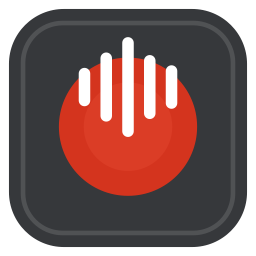

<p align="center">
  
</p>

# NoteTaker

마이크와 Mac의 시스템 오디오를 함께 녹음하는 네이티브 macOS 앱입니다. 이어폰을 사용하면서 내 목소리와 회의 상대방의 소리를 한 파일에 저장할 수 있습니다.

A native macOS recorder for microphone and system audio, with local storage, playback, and a recording library. Built with SwiftUI and Core Audio Process Taps.

## 현재 지원 기능

- **세 가지 녹음 모드:** 마이크 + 시스템, 마이크만, 시스템만
- **녹음 제어:** 일시정지, 재개, 일시정지 중 미리듣기, 완료 후 자동 저장
- **재생:** 재생/일시정지, 기본 파형, 위치 탐색, 앞뒤 15초 이동
- **라이브러리:** 이름 변경, 제목 검색, 즐겨찾기, 최근 삭제, 복구, 영구 삭제
- **파일 활용:** 공유, `.m4a` 내보내기, Finder에서 보기
- **설정:** 입력 마이크 선택, 녹음 모드, 마이크/시스템 입력 게인
- **복구:** 비정상 종료 후 정상적으로 닫힌 녹음 세그먼트 복구
- **Mac 창 동작:** 빨간 닫기 버튼은 창만 닫으며, Dock 아이콘으로 다시 열기
- **메뉴 막대 녹음:** 메인 창을 닫아도 상단 아이콘에서 시작·일시정지·재개·완료, 녹음 상태와 경과 시간 확인
- 한국어/영어 UI, 시스템 라이트/다크 모드, 앱 아이콘

출력은 **48 kHz 스테레오 AAC, 128 kbps의 `.m4a`** 파일입니다. 가상 오디오 드라이버를 설치할 필요가 없습니다.

## 요구 사항

- Apple Silicon Mac
- macOS 26 이상
- Xcode 26 이상, Swift 6.2 이상이 포함된 전체 Xcode 개발 도구
- [XcodeGen](https://github.com/yonaskolb/XcodeGen)
- 로컬 실행을 위한 본인의 Apple Development 서명 인증서

현재는 소스를 직접 빌드하는 개발 버전입니다. 공증된 설치 패키지는 포함하지 않습니다.

## 빌드 및 실행

```sh
git clone https://github.com/Seonwoo82/Mac-NoteTaker.git
cd Mac-NoteTaker
brew install xcodegen
cp Config/Local.xcconfig.example Config/Local.xcconfig
```

Xcode의 **Settings → Accounts**에서 본인의 Apple 계정을 등록하고 Apple Development 인증서를 준비합니다. `Config/Local.xcconfig`의 `YOUR_TEAM_ID`를 본인의 개발 팀 ID로 바꿉니다.

```xcconfig
DEVELOPMENT_TEAM = YOUR_TEAM_ID
CODE_SIGN_IDENTITY = Apple Development
```

`Local.xcconfig`는 Git에서 제외됩니다. 인증서, 개인 키, 본인의 서명 설정을 커밋하지 마세요.

```sh
make gen
make build
open build/DerivedData/Build/Products/Debug/NoteTaker.app
```

`xcodebuild`가 Command Line Tools를 가리킨다면 Xcode의 **Settings → Locations → Command Line Tools**에서 설치된 Xcode를 선택합니다.

항상 `.app`을 Finder나 `open`으로 실행합니다. 번들 내부 실행 파일을 터미널에서 직접 실행하면 오디오 권한의 대상 앱이 달라질 수 있습니다. 빌드한 `NoteTaker.app`을 응용 프로그램 폴더에 복사하면 Dock에서 사용할 수 있습니다.

## 사용 방법

1. **새로운 녹음** 버튼을 클릭합니다. 기본 모드는 마이크 + 시스템입니다.
2. 처음 요청되는 마이크/시스템 오디오 권한을 허용합니다.
3. 필요하면 일시정지하고 지금까지의 녹음을 미리 들어봅니다. 재개하면 녹음이 이어집니다.
4. **완료**를 누르면 저장된 항목이 목록에 표시됩니다.
5. 항목을 선택해 재생하거나 이름 변경, 즐겨찾기, 공유 등을 사용합니다.

모드와 마이크는 녹음 버튼의 컨텍스트 메뉴 또는 설정에서 선택할 수 있습니다. 일반 삭제는 파일을 즉시 없애지 않고 **최근 삭제된 항목**으로 이동합니다. 삭제 후 30일이 지난 항목은 라이브러리를 열 때 정리되며, 그 전에는 복구할 수 있습니다.

빨간 닫기 버튼은 앱을 종료하지 않습니다. 창을 닫아도 진행 중인 녹음은 유지되며, Dock 아이콘을 누르면 창이 다시 열립니다. 완전히 종료하려면 **⌘Q** 또는 NoteTaker 메뉴의 종료를 사용합니다. 녹음 중 종료하면 파일 마무리를 기다립니다.

### 메뉴 막대에서 빠르게 녹음하기

NoteTaker가 실행 중이면 화면 상단 메뉴 막대에 파형 아이콘이 표시됩니다. 아이콘을 눌러 **녹음 시작**을 선택하면 메인 창을 열지 않고 현재 설정된 모드로 녹음합니다. 같은 패널에서 **일시정지**, **재개**, **완료**를 사용할 수 있습니다.

녹음 중에는 상단 아이콘이 바뀌고 경과 시간이 표시됩니다. **NoteTaker 열기**를 누르면 진행 중인 녹음 또는 저장된 항목을 메인 창에서 볼 수 있습니다. 권한이나 저장 오류가 나면 패널에 안내가 표시되며 다시 시도할 수 있습니다.

메뉴 막대와 메인 창은 하나의 녹음 세션을 공유합니다. 앱을 완전히 종료하면 상단 아이콘도 사라지며, 로그인 시 자동 실행 설정은 변경하지 않습니다.

### 주요 단축키

| 동작 | 단축키 |
|---|---|
| 새로운 녹음 | ⌘N |
| 녹음 완료 | ⌘Return |
| 재생/일시정지 | Space |
| 녹음 중 일시정지 | Space |
| 앞뒤 15초 이동 | ⌘← / ⌘→ |
| 제목 검색 | ⌘F |
| 이름 변경 | Return |
| 삭제 | Delete |
| 즐겨찾기 전환 | ⇧⌘L |
| 내보내기 | ⇧⌘E |
| Finder에서 보기 | ⇧⌘R |
| 설정 | ⌘, |
| 완전 종료 | ⌘Q |

문자 입력 중에는 녹음·재생 단축키가 입력을 가로채지 않도록 제한됩니다.

## 저장 및 개인정보

녹음은 Mac의 아래 디렉터리에 저장됩니다. 앱은 녹음을 자동으로 서버에 업로드하지 않으며, 별도 계정이나 클라우드 서버 설정이 필요하지 않습니다.

```text
~/Library/Application Support/NoteTaker/Recordings/<recording-id>/
  audio.m4a       # 완료된 녹음
  meta.json       # 제목, 날짜, 모드, 즐겨찾기 등
  segments/       # 진행 중 또는 복구 대상인 녹음 조각
```

공유와 내보내기는 사용자가 실행할 때만 수행됩니다. 이 저장소에는 실제 녹음, 사용자 설정, 개인 서명 정보, 로컬 개발 기록이나 빌드 결과물을 포함하지 않습니다.

마이크와 시스템 오디오 권한은 macOS **시스템 설정 → 개인정보 보호 및 보안**에서 관리할 수 있습니다. 사용하지 않는 녹음 모드의 권한을 미리 설정할 필요는 없습니다.

## 알려진 제한

- **자동 전사, 전사문 검색, 트리밍, 재생 속도 조절, 무음 건너뛰기, 음성 향상은 아직 구현되어 있지 않습니다.**
- 현재 파형은 기본 탐색용입니다. 긴 녹음에 대한 확대/축소 타임라인은 포함하지 않습니다.
- 비정상 종료 시 복구 대상은 정상적으로 닫힌 세그먼트입니다. 마지막으로 열려 있던 세그먼트는 복구하지 못할 수 있습니다.
- Bluetooth 이어폰의 마이크를 사용하면 장치의 통화 모드 전환으로 음질이 낮아질 수 있습니다. 필요하면 Mac 내장 마이크를 선택하세요.
- 장치 연결 해제나 오디오 형식 변경 시 녹음을 안전하게 중단합니다. 녹음 중 입력 장치를 바꾸는 기능은 지원하지 않습니다.
- 시스템 오디오 권한과 장치 구성에 따른 실제 캡처는 실기기 검증이 필요합니다. 자동 테스트만으로 모든 장치 조합을 보장하지 않습니다.

## 개발 및 테스트

```sh
make test-audio   # AudioPipeline 패키지 테스트
make test         # 앱 단위 테스트
make uitest       # macOS UI 테스트: 데스크톱을 조작함
make sign-check   # 앱 코드 서명/권한 확인
```

UI 테스트는 임시 라이브러리와 가짜 오디오 엔진을 사용합니다. 실제 마이크 권한이나 사용자 녹음은 사용하지 않습니다. UI 테스트가 실행되는 동안 다른 창으로 포커스를 이동하면 실패할 수 있습니다.

AudioPipeline 테스트 **233개**를 2026-09-07에, 앱 단위 테스트 **152개**와 메뉴 막대 녹음/오류 재시도 UI 테스트 **2개**를 2026-09-08에 통과했습니다. 창 닫기/재열기 회귀 테스트도 별도로 포함합니다. 공개용 소스에서의 앱 빌드도 확인했습니다. UI 테스트 전체와 실제 오디오 장치 검증은 별도 항목입니다.

실제 장치에서 녹음을 점검하려면 실행 중인 앱을 정상 종료한 뒤 다음 스모크 테스트를 사용할 수 있습니다.

```sh
make smoke MODE=micOnly SECONDS=10
make smoke MODE=systemOnly SECONDS=10
make smoke MODE=micAndSystem SECONDS=10
```

스모크 테스트는 실제 오디오 권한을 요청하며 `build/` 아래에 테스트 녹음을 만듭니다. 시스템 오디오 검사는 테스트 음성을 재생합니다. 생성된 파일은 공개 저장소에 올리지 마세요.

## 프로젝트 구성

```text
NoteTaker/               SwiftUI 앱, 녹음/재생 상태, 라이브러리, 설정
Packages/AudioPipeline/  Core Audio 캡처, 믹싱, 세그먼트, 파일 쓰기, 재생
NoteTakerTests/          앱 단위 테스트
NoteTakerUITests/        macOS UI 테스트
Config/                 공개용 서명 설정 예시
scripts/                오디오 검사와 앱 아이콘 생성 도구
project.yml             XcodeGen 프로젝트 정의
Makefile                빌드·테스트 명령
```

Xcode 프로젝트는 `project.yml`에서 생성합니다. 소스 파일을 추가하거나 프로젝트 설정을 변경한 뒤에는 `make gen`을 실행하세요.

Apple 음성 메모에서 익숙한 사용 흐름을 참고한 독립 프로젝트이며, Apple이 제작하거나 보증하는 앱은 아닙니다.
